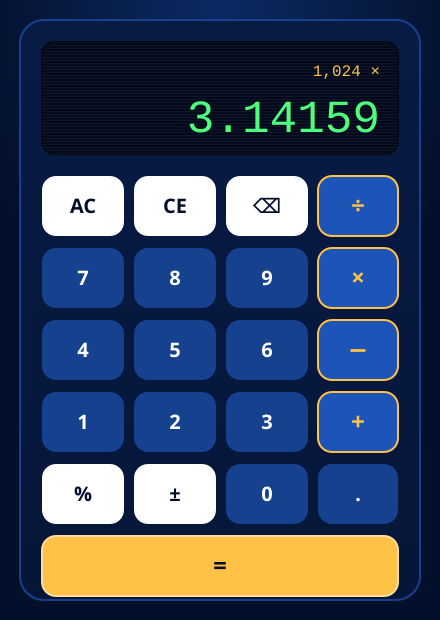

# Retro LED Calculator

[](tests/engine.test.js)
[](package.json)
[](engine.js)
[](LICENSE)
[](https://msiddhant93.github.io/retro_calculator/)

A desktop-grade calculator dressed as a 1970s navy-and-amber LED machine.
No frameworks, no build step, no dependencies: three files, a pure state
machine, and a fully keyboard-accessible interface.

**[Live demo](https://msiddhant93.github.io/retro_calculator/)** &middot;
[Report an issue](https://github.com/MSIDDHANT93/retro_calculator/issues)

<p align="center">
  
</p>

> Real device captures and an animated demo can be dropped into
> [`screenshots/`](screenshots/README.md); the vector preview above ships by
> default so the repository renders without binary assets.

---

## Overview

Most tutorial calculators evaluate a string and call it done. This one models
an actual calculator: an entry buffer, an accumulator, a pending operator, and
a remembered last operation for repeated `=`. Every arithmetic path is pushed
through one normaliser, so `NaN`, `Infinity` and binary float noise can never
reach the display.

The logic lives in `engine.js` with **zero DOM references**, which is what makes
the whole thing testable in Node while still being a plain `<script>` tag in the
browser.

---

## Features

### Calculator behaviour

- Chained calculations evaluated left to right (`2 + 3 * 4 = 20`)
- Repeated `=` repeats the last operation (`2 + 3 = = =` -> `11`)
- Operator replacement (`8 + * 2 =` -> `16`)
- Desktop-style percent: `200 + 10%` -> `220`, `200 * 10%` -> `20`
- Sign toggle, `AC`, `CE` and backspace with real desktop semantics
- Leading-zero collapsing (`0000123` -> `123`) and single-decimal enforcement
- 12-digit entry cap with automatic scientific notation beyond it

### Error and precision handling

| Input | Result |
| --- | --- |
| `10 / 0` | `DIV BY 0` |
| `0 / 0` | `NOT A NUMBER` |
| overflow to `Infinity` | `OVERFLOW` |
| `0.1 + 0.2` | `0.3` (float noise stripped at 12 significant digits) |
| `999999999999 * 999999999999` | `1e24` |

Errors latch the display, shake once, and clear on the next keypress or `AC`.

### Interface

- LED panel with unlit ghost segments, scanlines and a slow CRT sweep
- Digit-change animation and a blinking entry caret
- Responsive font scaling in four steps so long results never overflow
- Press, hover, active, focus and disabled states on every key
- `CE` disables itself when it would do nothing

### Accessibility

- Full keyboard operation plus a skip link to the keypad
- Visible 3px focus ring, independent of the hover style
- `aria-label` on every glyph key; a polite live region announces each result
- Palette meets WCAG AA: `#4dff7d` on `#020a1c` is 12.8:1, amber on navy 11.6:1
- Honours `prefers-reduced-motion` and Windows forced-colors mode

### Responsive

- 320px phones upward, no horizontal scroll at any width
- Touch targets are 58px tall on phones, 64px on tablets
- Dedicated landscape rule keeps the keypad on screen on short viewports

---

## Keyboard shortcuts

| Key | Action |
| --- | --- |
| `0`-`9` | Enter a digit |
| `.` or `,` | Decimal point |
| `+` `-` `*` `/` | Operators (`x` also multiplies) |
| `Enter` or `=` | Evaluate |
| `%` | Percent |
| `Backspace` | Delete last character |
| `Delete` | Clear entry (`CE`) |
| `Esc` | All clear (`AC`) |
| `Tab` / `Shift+Tab` | Move between keys |

Pressing a shortcut flashes the matching on-screen key, so keyboard and pointer
input give identical feedback.

---

## Technologies

- **HTML5** - semantic landmarks, ARIA live region, SVG favicon
- **CSS3** - custom properties, Grid, `clamp()` fluid type, keyframe animations,
  `contain: content` on the display to isolate repaints
- **JavaScript (ES5-compatible, no build)** - UMD-wrapped engine module
- **Node.js test runner** (`node:test`) - dependency-free automated suite

---

## Architecture

```
index.html      markup, ARIA, key definitions via data-attributes
styles.css      design tokens -> layout -> display -> keypad -> media queries
engine.js       pure state machine (no DOM) - UMD: window + CommonJS
app.js          UI controller: caches DOM, dispatches actions, renders snapshots
tests/          automated suite + manual browser checklist
```

**Data flow**

```
click / keydown  ->  app.js  ->  engine.dispatch(action, payload)
                                        |
                                        v
                                  CalculatorSnapshot
                     { display, expression, isError, isEntering, canClearEntry }
                                        |
                                        v
                     app.js render() - diffed against the last snapshot,
                                       only changed nodes are written
```

**Design decisions**

- *Snapshot rendering.* The engine returns a full view model; the controller
  diffs it against the previous one, so a keypress touches at most four nodes.
- *One delegated listener.* All 21 keys share a single click handler on the
  keypad container instead of 21 individual listeners.
- *Action table over switch.* Handlers are looked up in a map keyed by action
  name, which keeps `dispatch` flat and makes new keys a one-line addition.
- *UMD wrapper.* Lets the same file power `file://` browsing (no CORS issues
  from ES modules) and `require()` in tests.

---

## Installation

No build step and no dependencies.

```bash
git clone https://github.com/MSIDDHANT93/retro_calculator.git
cd retro_calculator
```

Then either open `index.html` directly, or serve it:

```bash
npx serve .
```

### Tests

```bash
npm test        # node --test "tests/**/*.test.js"
```

24 automated cases cover arithmetic, chaining, repeated equals, operator
replacement, percent, sign, `AC`/`CE`/backspace, leading zeros, decimal edge
cases, digit caps, scientific notation, divide-by-zero, `NaN`, instance
isolation and a 500-operation stress run.

Browser-only behaviour (animations, focus order, screen reader output,
responsive breakpoints, Lighthouse) is tracked in
[`tests/MANUAL-CHECKLIST.md`](tests/MANUAL-CHECKLIST.md).

---

## Deployment

The project is fully static, so GitHub Pages serves it as-is with no build step.

**Settings > Pages > Source: `Deploy from a branch` > Branch: `main` / `(root)`**

The site then goes live at
`https://msiddhant93.github.io/retro_calculator/` within a minute or two.

---

## Future improvements

- Memory keys (`M+`, `M-`, `MR`, `MC`) and a scrollable calculation tape
- Scientific mode: parentheses, powers, roots, trigonometry
- Theme switcher (amber CRT, green phosphor, light mode) persisted in
  `localStorage`
- Service worker so the calculator installs as an offline PWA
- Playwright end-to-end tests to automate the manual checklist
- `expression`-line editing: click a past result to reuse it

---

## License

[MIT](LICENSE)
